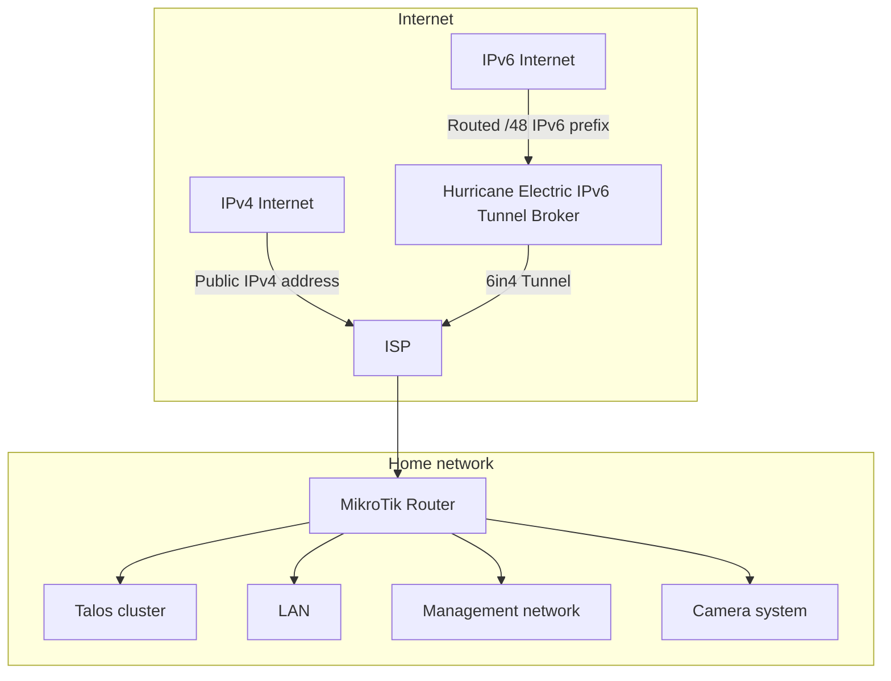
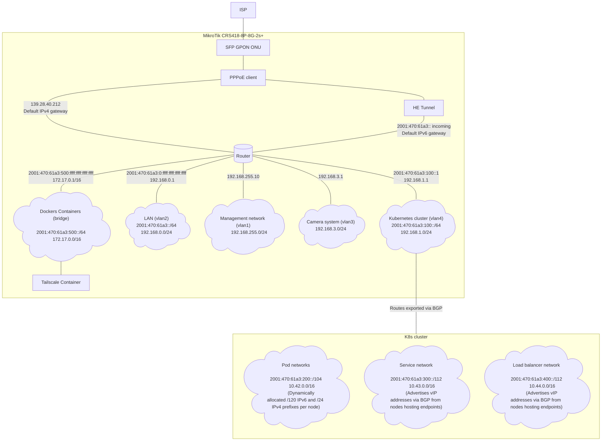
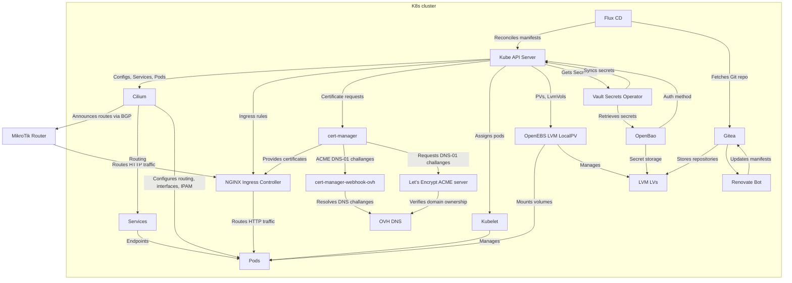
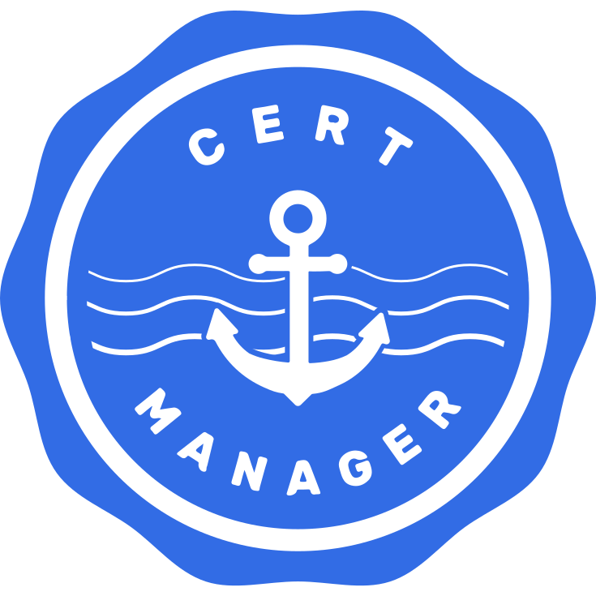

# Homelab

This repo contains configuration and documentation for my homelab setup, which is based on Talos OS for Kubernetes cluster and MikroTik router.

## Architecture

Physical setup consists of MikroTik router which connects to the internet and serves as a gateway for the cluster and other devices in the home network as shown in the diagram below.

Devices are separated into VLANs and subnets for isolation and firewalling between devices and services. Whole internal network is configured to eliminate NAT where unnecessary. Pods on the Kubernetes cluster communicate with the router using native IP routing, there is no encapsulation, overlay network nor NAT on the nodes. Router knows where to direct packets destined for the pods because the cluster announces its IP prefixes to the router using BGP. Router also performs NAT for IPv4 traffic from the cluster to and from the internet, while IPv6 traffic is routed directly to the internet without NAT. High level logical routing diagram is shown below.

Currently the k8s cluster consists of single node (hostname anapistula-delrosalae), which is a PC with Ryzen 5 3600, 64GB RAM, RX 580 8GB (for accelerating LLMs), 1TB NVMe SSD, 2TB and 3TB HDDs and serves both as control plane and worker node.

## Software stack

The cluster itself is based on [Talos Linux](https://www.talos.dev/) (which is also a Kubernetes distribution) and uses [Cilium](https://cilium.io/) as CNI, IPAM, kube-proxy replacement, Load Balancer, and BGP control plane. Persistent volumes are managed by [OpenEBS LVM LocalPV](https://openebs.io/docs/user-guides/local-storage-user-guide/local-pv-lvm/lvm-overview). Applications are deployed using GitOps (this repo) and reconciled on cluster using [Flux](https://fluxcd.io/). Git repository is hosted on [Gitea](https://gitea.io/) running on a cluster itself. Secets are kept in [OpenBao](https://openbao.org/) (HashiCorp Vault fork) running on a cluster and synced to cluster objects using [Vault Secrets Operator](https://github.com/hashicorp/vault-secrets-operator). Deployments are kept up to date using self hosted [Renovate](https://www.mend.io/renovate/) bot updating manifests in the Git repository. Incoming HTTP traffic is routed to cluster using [Nginx Ingress Controller](https://kubernetes.github.io/ingress-nginx/) and certificates are issued by [cert-manager](https://cert-manager.io/) with [Let's Encrypt](https://letsencrypt.org/) ACME issuer with [cert-manager-webhook-ovh](https://github.com/aureq/cert-manager-webhook-ovh) resolving DNS-01 challanges. Cluster also runs [CloudNativePG](https://cloudnative-pg.io/) operator for managing PostgreSQL databases. High level core cluster software architecture is shown on the diagram below.

<!-- TODO: Backups, monitoring, logging, deployment with ansible etc -->

## Applications / Services

| Logo | Name | Address | Description |
|------|------|---------|-------------|
|  | Gitea | https://gitea.lumpiasty.xyz/ | Private Git repository hosting and artifact storage (Docker, Helm charts) |
|  | OpenBao | https://openbao.lumpiasty.xyz:8200/ | Secret storage (HashiCorp Vault compatible) |
|  | Renovate | | Bot for keeping dependencies up to date |
|  | cert-manager | | Automatic TLS certificate management |
|  | Nginx Ingress Controller | | Ingress controller for routing external traffic to services in the cluster |
|  | CloudNativePG | | PostgreSQL operator for managing PostgreSQL instances |
|  | Immich | https://immich.lumpiasty.xyz/ | Self-hosted photo and video backup and streaming service |
|  | iSpeak3.pl | [ts3server://ispeak3.pl](ts3server://ispeak3.pl) | Public TeamSpeak 3 voice communication server |
|  | LLaMA.cpp | https://llama.lumpiasty.xyz/ | LLM inference server running local models with GPU acceleration |
|  | Open WebUI | https://openwebui.lumpiasty.xyz/ | Web UI for chatting with LLMs running on the cluster |
|  | Frigate | https://frigate.lumpiasty.xyz/ | NVR for camera system with AI object detection and classification |

