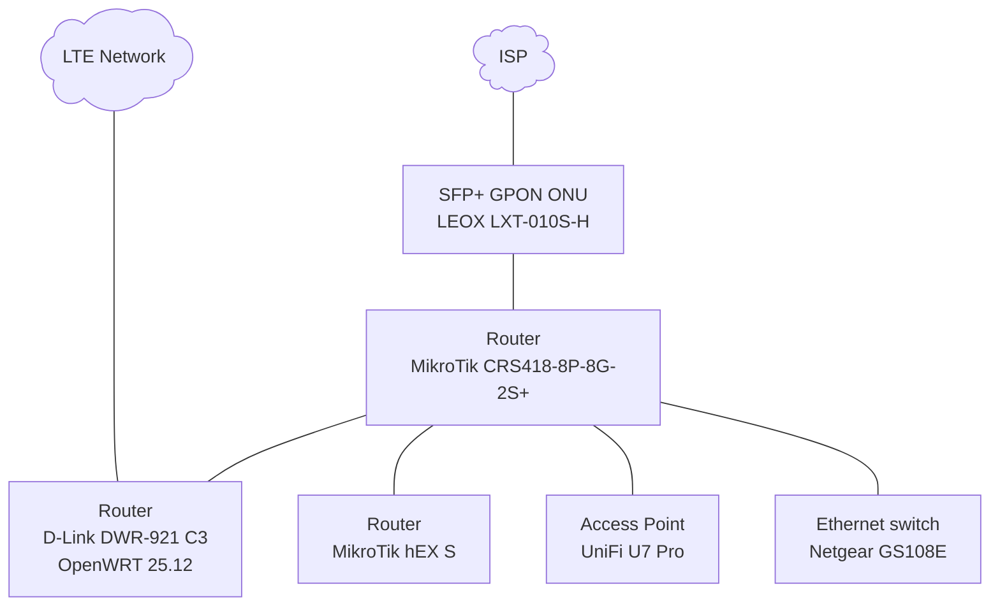
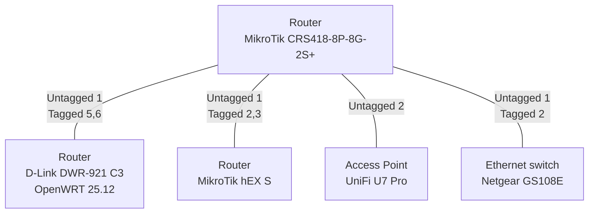

# Network topology

Network consists of 2 MikroTik routers, 1 OpenWRT router, UniFi AP, Netgear switch. Internet is connected via GPON ONU connected to MikroTik router with fallback LTE network in D-Link router. They are connected like in the diagram below below:

Above diagram lists only active network devices, does not show passive/unmanaged network elements or nodes.

## Internal structure

Network is divided to multiple VLANs to enforce strict access control rules using stateful firewall. There are 6 VLANs:

- 1: Management network 
  No internet access, no outbound access to other networks 
  IP: 192.168.255.0/24 
  Static IP configuration
- 2: General purpose LAN 
  Access to every other network 
  IP: 192.168.0.0/24 /  2001:470:61a3:9::/64 
  Gateway: 192.168.0.1 / 2001:470:61a3:9:ffff:ffff:ffff:ffff 
  DHCP / SLAAC
- 3: Cameras 
  No internet access, no outbound access to other networks 
  IP: 192.168.3.0/24 
  Gateway: 192.168.3.1 
  Static IP configuration
- 4: Server LAN (k8s cluster) 
  Access to internet, cameras 
  IP: 192.168.1.0/24 / 2001:470:61a3:100::/64 
  Gateway: 192.168.1.1 / 2001:470:61a3:100::1 
  Static IP configuration
- 5: IoT Network 
  Internet access only 
  IP: 192.168.5.0/24 / 2001:470:61a3:a::/64 
  Gateway: 192.168.5.1 / 2001:470:61a3:a:ffff:ffff:ffff:ffff 
  DHCP / SLAAC, accessible via separate WiFi network "szafa" from D-Link for absolutely untrusted Tuya and like devices
- 6: Internet access for OpenWRT 
  Internet access only 
  IP: 192.168.6.0/24 / 2001:470:61a3:600::/64 
  Gateway: 192.168.6.1/24 / 2001:470:61a3:600::1/64 
  Static IP configuration

VLANs are connected between devices like on following diagram:

There are also networks, which are not VLANs, but are routed:

- Tailscale, container on CRS 
  Access to every other network, including internet (exit node) 
  IP: 100.64.0.0/10 / fd7a:115c:a1e0::/48 
  Allocations managed completely by Tailscale
- Kubernetes cluster, routes exposed to CRS via BGP using Cilium 
  Access to internet, cameras 
  Pods: 10.42.0.0/16 (/24 subnet per node), 2001:470:61a3:200::/104 (/120 subnet per node) 
  Service: 10.43.0.0/16, 2001:470:61a3:300::/112 
  LoadBalancer: 10.44.0.0/16, 2001:470:61a3:400::/112 
  Assigned by Cilium MultiPool IPAM (pods), kube-apiserver (services), Cilium LB (LoadBalancer) 
  Native IP routing, no overlay, VXLAN etc. 
  LoadBalancer is reachable from the internet using IPv6 directly or IPv4 port forwards, leveraging ECMP.
- GPON ONU management 
  IP: 192.168.100.0/24 
  Static assignment on CRS, access to factory IP of ONU
- Containers on CRS 
  Access to every other network 
  IP: 172.17.0.1/16, 2001:470:61a3:500::/64 
  Static IP management

Whole network is designed to eliminate VLANs, overlays where unnecessary to keep things simple. Only NAT rules are:

- Masquerade outbound IPv4 via GPON PPPoE
- Masquerade to GPON ONT management 
  It doesn't have a gateway configured, we want to access it from other networks so we need to talk to it as if we were in the same subnet
- src-nat tailscale IPv6 to internet 
  Tailscale assigns IPv6 from private subnet with no way to configure it, so the assigned IPs are not routable
- IPv4 port forwards from GPON PPPoE to respective services

There is also an UPnP and NAT-PMP enabled to automatically configure port forwards from LAN.

## Uplink

Main internet connection is a fibre optics (GPON) service from my ISP, which includes static, publicly reachable IPv4 address. I'm using my own GPON ONU, which is a SFP+ module inserted to CRS, I configured it to clone ISP-provided Huawei box. I'm authenticated using PPPoE credentials and it hands out public IP address directly to the router.

One of quirks of the ISP is that it doesn't allow incoming port 53/DNS connections, which disables me from hosting DNS server, I was wanting to do to configure reverse DNS for pods IPv6. The configuration for public DNS server is still remaining cluster.

The ISP does not provide any IPv6 connectivity at all. For that purpose I'm using [tunnel broker from Hurricane Electric](https://tunnelbroker.net/), which gives /48 routed prefix that I divided to /64 networks.

There used to be backup internet link using USB LTE modem connected to CRS, which was exposing NDIS interface, but when installing D-Link I decided to remove the modem and move SIM card to it to reduce clutter in rack and have direct access to fully fledged modem, not just web interface management. Configuration of lte1 modem is yet to be removed from the CRS configuration. Modem in D-Link requires workaround to work due to firmware bug, described in detail in [LTE failover (BroadMobi BM806C / D-Link DWR-921 C1) — QMI data-plane workaround](./wwan-bm806c-qmi-workaround.md). It is currently partially configured, with internet working on OpenWRT router when enabled, but failover functionality of internet gateway on CRS is yet to be designed and implemented.
SIM card allows for IPv4 and IPv6 connectivity via separate APNs. Network hands out globally routable IPv6 prefix, but there are no incoming IPv6 connections, which is most likely network carrier enforced firewall. Network works when using two different APNs at once, but when using the card in Android phone, there's no need to configure two separate APNs, IPv6 alone is sufficient. Whether the network announces NAT64 and Android phone is doing CLAT or how is that working exactly and if we can utilize it in our network to simplify connection is yet to be figured out.

## Configuration management

Currently, only CRS and D-Link are managed in this repository. Other devices currently have been configured manually using dedicated web interface/tools. The end goal is to have full configuration as code.

Network devices are configured using Ansible with playbooks under [ansible/playbooks](../ansible/playbooks/) subdirectory:

- [openwrt.yml](../ansible/playbooks/openwrt.yml) - Configuration of D-Link router
- [routeros.yml](../ansible/playbooks/routeros.yml) - configures CRS router

There is also one one-time initialisation playbook called [dlink-init.yml](../ansible/playbooks/dlink-init.yml) that is used to configure basic D-Link settings from scratch after configuration reset so it can be accessed from management network.

To reconcile configuration from this repository to device, execute `ansible-playbook playbooks/<playbook>` from `ansible` directory. It will automatically load necessary secrets from vault and start applying configuration. Playbooks without `-init` in their name should be idempotent.
